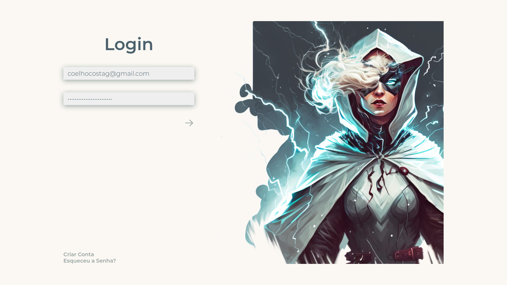
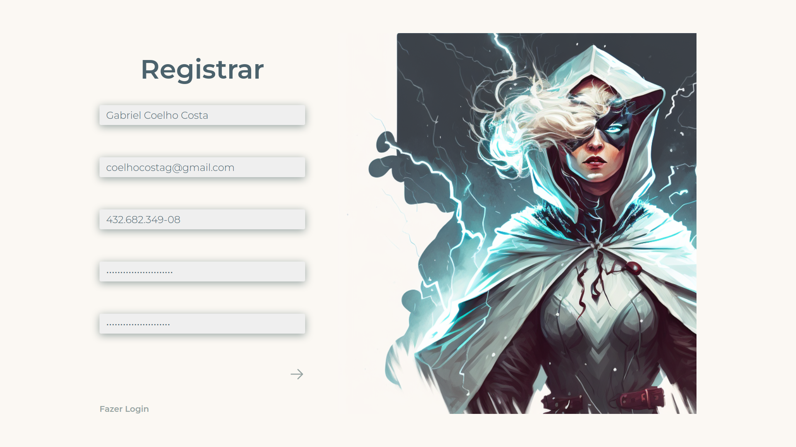
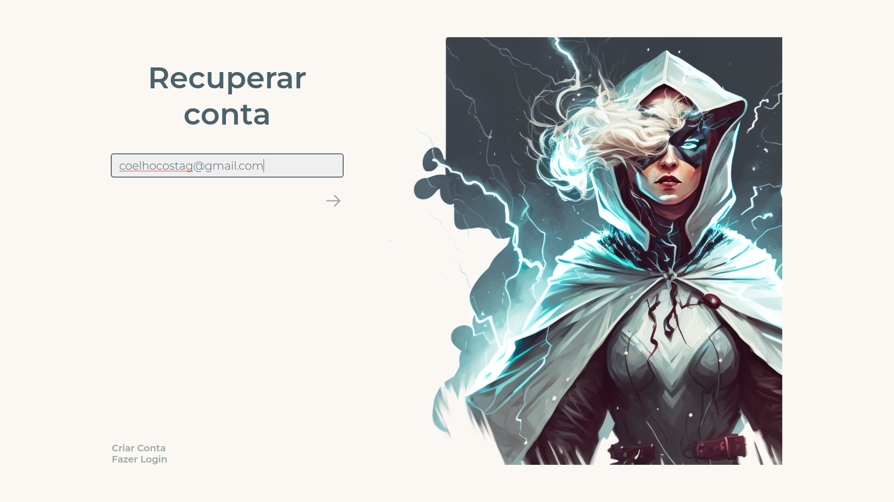
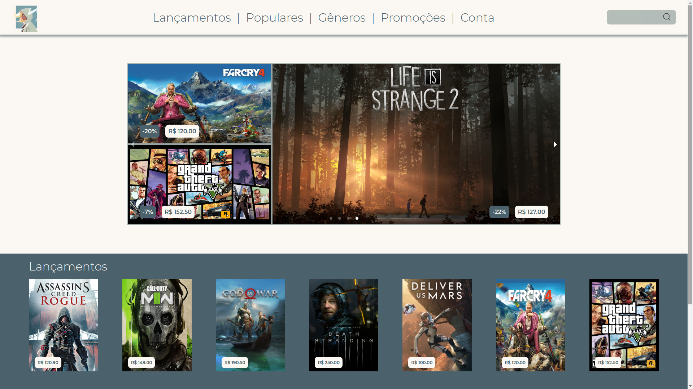
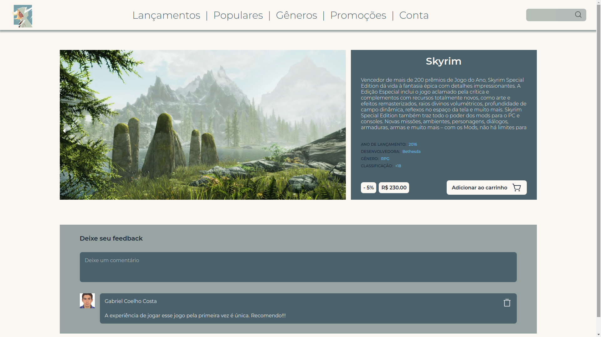
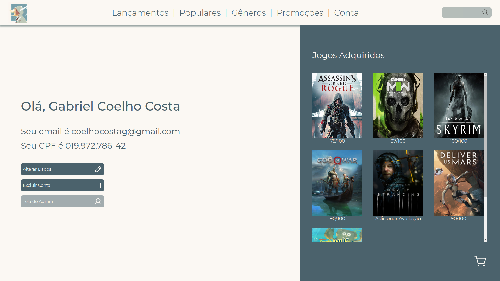
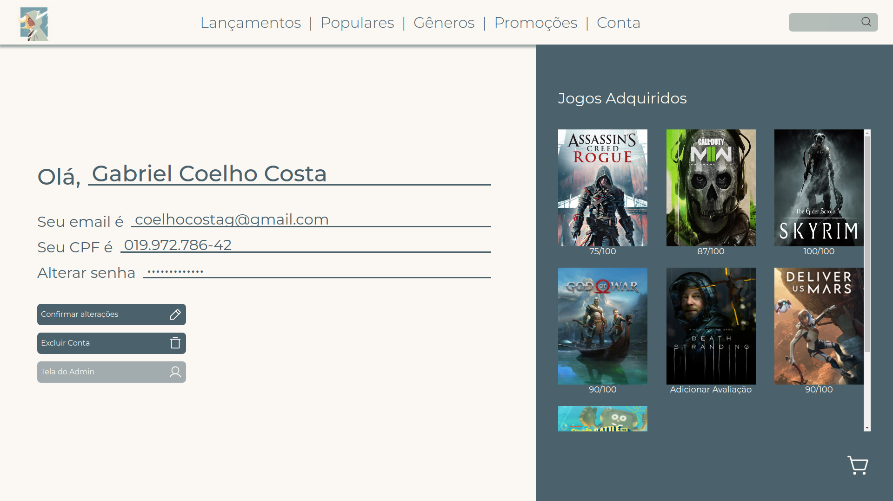

# Game Dame

### A plataforma digital com a maior biblioteca de jogos do mundo

Projeto desenvolvido durante o processo Trainee da **Emakers**, empresa júnior vinculada à **UFLA**.

## Página de Login

&nbsp;

&nbsp;

&nbsp;

## Página de Cadastro

&nbsp;

&nbsp;

&nbsp;

## Página de Recuperar Senha

&nbsp;

&nbsp;

&nbsp;

## Página da Loja de Jogos

&nbsp;

&nbsp;

&nbsp;

## Página do Jogo

&nbsp;

&nbsp;

&nbsp;

## Página do Usuário

&nbsp;

&nbsp;

